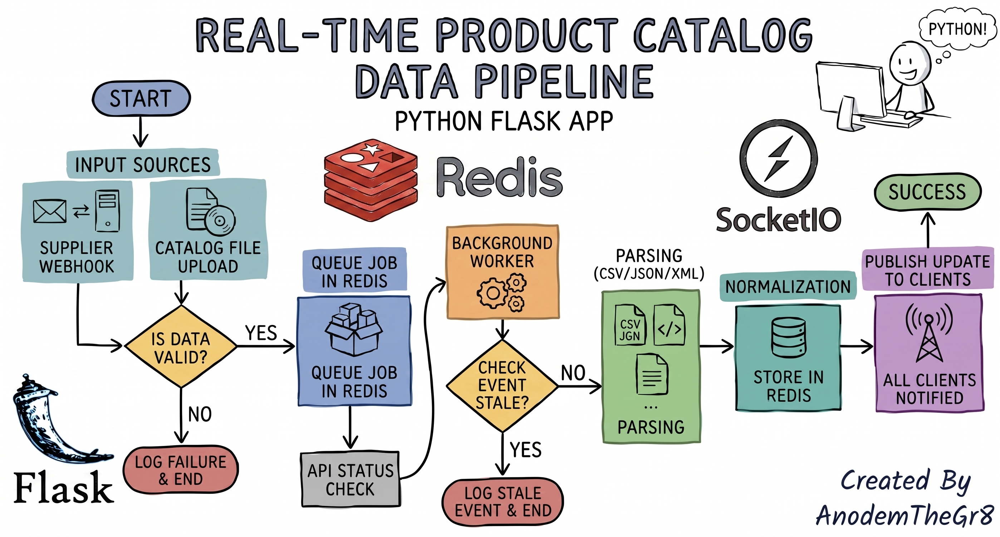

# Real-Time Product Catalog Data Pipeline



This project is a real-time product catalog data pipeline built with Python, Flask, Redis, and Socket.IO. It ingests supplier webhook events and uploaded catalog files, validates and normalizes the data, processes queued jobs asynchronously, stores the latest product state in Redis, and broadcasts live updates to connected clients in real time.

The pipeline accepts data from multiple sources, checks whether the input is valid, parses it into a common product format, stores the latest version, and pushes the updates to users instantly. This makes it a real-time catalog synchronization system rather than a simple static web application.

## Scope of the project

The app does four main things:

- accepts product updates from suppliers through webhooks
- accepts product catalogs from files such as CSV, JSON-LD, and XML
- processes the data asynchronously using Redis queues and worker processes
- broadcasts live changes to front-end clients using Socket.IO

In simple terms, this project is not a full e-commerce website. It is a backend data-processing pipeline with real-time product updates.

The goal is to ingest data, normalize it into one format, save the latest version, and push updates to connected users immediately.

---

## What is a webhook?

A webhook is a way for one system to automatically send data to another system when an event happens.

For example, when a supplier updates a product price, they can send a POST request to this app with a payload like:

```json
{
  "event_type": "price.changed",
  "data": {
    "id": "abc123",
    "price": 19.99,
    "version": 2
  }
}
```

This project verifies the signature of the webhook and then queues the event for processing.

Webhook flow:

- supplier sends event
- app verifies the signature
- event is stored in Redis queue
- worker processes it
- product info is updated in Redis
- browser clients receive live updates

---


## Prerequisites and technologies

### Python
Python is the main programming language used in the project. It is used to build the Flask app, parse files, process events, and run the worker.

Recommended:

- Python 3.10+
- virtual environment enabled for project dependencies

### Flask
Flask is a lightweight Python web framework used to create the web app and API routes.

In this project, Flask is responsible for:

- handling HTTP requests
- exposing API endpoints
- serving the home page
- checking application health

This is the web server layer.

### Redis
Redis is an in-memory data store and message queue used for:

- storing queued jobs
- storing product state
- publishing updates to workers and clients
- coordinating asynchronous processing

Without Redis, the app would not be able to process jobs and broadcast updates reliably.

### Socket.IO
Socket.IO provides real-time, two-way communication between the server and browser clients.

In this project, it is used to:

- connect browser clients to the app
- send live product updates instantly
- update user views without reloading the page

This is how the app delivers live catalog changes.

### Faker
Faker is a Python library for generating fake sample data.

It is useful for:

- testing product records
- generating mock supplier events
- creating examples without real production data

This helps developers simulate realistic catalog input.

### Chart.js
Chart.js is a JavaScript library used to draw charts in the browser.

In this project, it can be used to visualize:

- product prices
- inventory counts
- category updates
- dashboard analytics

It is a frontend visual tool, not a Python backend tool.

### Docker / Docker Compose
Docker is used to run Redis in a containerized way. The repo includes a docker-compose file, which makes setup easier and more consistent.

---

## Project structure

- `app.py`: Flask app startup and route registration
- `config.py`: environment settings and configuration values
- `extensions.py`: Redis connection and update bridge logic
- `transformers.py`: validates and normalizes supplier events
- `workers.py`: background processing for queue jobs and events
- `worker.py`: runs the worker process
- `routes/ingest.py`: upload, task status, and webhook endpoints
- `parsers/`: CSV, JSON-LD, and XML file parsers
- `services/`: parsing, normalization, and persistence logic
- `sockets.py`: room management and live broadcast logic
- `templates/index.html`: demo front-end page for live updates
- `tests/`: project tests for parser and webhook behavior
- `docker-compose.yml`: Redis container setup
- `requirements.txt`: Python dependencies

---

## Setup Instructions

### 1. Clone the project

```bash
git clone <repo-url>
cd Payolle_v26.0.0
```

### 2. Create a Python virtual environment

On Linux or macOS:

```bash
python3 -m venv .venv
source .venv/bin/activate
```

On Windows:

```powershell
python -m venv .venv
.\.venv\Scripts\Activate.ps1
```

### 3. Install dependencies

```bash
pip install -r requirements.txt
```

This installs Flask, Redis client libraries, Socket.IO support, and related required packages.

### 4. Start Redis

This project expects Redis to be running locally on port 6379.

Using Docker Compose:

```bash
docker compose up -d redis
```

You can verify Redis is running:

```bash
redis-cli ping
```

Expected response:

```bash
PONG
```

### 5. Start the Flask app

```bash
python app.py
```

The app runs by default on:

```text
http://localhost:5000/
```

### 6. Start the worker

Open a second terminal and run:

```bash
source .venv/bin/activate
python worker.py
```

This worker listens to Redis queues and processes events or file upload jobs.

### 7. Open the UI

Visit:

```text
http://localhost:5000/
```

You should see the live product update page. It acts as a mock client for testing supplier events.

---

## API usage

### Health check

```bash
curl http://127.0.0.1:5000/health
```

This checks whether the app can access Redis.

### Upload catalog file

CSV example:

```bash
curl -X POST "http://localhost:5000/api/v1/ingest?format=csv" \
  -F "file=@catalog.csv"
```

The app accepts:

- CSV
- JSON-LD
- XML

### Check upload task status

```bash
curl http://localhost:5000/api/v1/tasks/<task_id>
```

### Supplier webhook example

```bash
curl -X POST http://localhost:5000/api/v1/webhooks/supplier \
  -H "Content-Type: application/json" \
  -H "X-Supplier-Signature: <hash>" \
  -d '{
    "event_type": "inventory.changed",
    "data": {
      "product_id": "abc123",
      "inventory": 12,
      "version": 5
    }
  }'
```

The app validates the request signature before accepting the event.

---

## Supported product data formats

### CSV
Requires columns:

- id
- title
- price
- qty

### JSON-LD
Supports Schema.org Product objects with fields like:

- sku
- productID
- name
- offers.price

### XML
Accepts a root element like:

```xml
<products>
  <product>
    <id>abc123</id>
    <title>Example product</title>
    <price>10.99</price>
    <qty>20</qty>
  </product>
</products>
```

---

## Notes for beginners

This project is a good example of a real-world backend pattern:

- web API receives data
- validation happens first
- jobs are queued
- workers process work in the background
- Redis stores the data and publishes update events
- Socket.IO delivers live updates to users

You do not need to memorize everything at once. The key idea is: the app accepts input, processes it asynchronously, and pushes real-time updates to clients.

---

## Production considerations

This project is a useful learning example, but for production use you would typically add:

- authentication and authorization
- rate limiting
- better error logging
- retry logic for failed jobs
- dead-letter queues
- secure Redis configuration
- stricter CORS control
- persistent monitoring and metrics

---

## Summary

This project is a live product catalog ingestion system built with:

- Flask for the web layer
- Redis for queueing and state management
- Socket.IO for real-time updates
- background workers for async processing
- file parsers for CSV, JSON-LD, and XML
- webhook support for supplier events

It is a practical project for learning backend engineering, asynchronous processing, and real-time communication.
